# FreeTube

A native SwiftUI YouTube client for iOS. Cookie-based auth, AVPlayer playback, offline downloads, no Google API key.

For personal use, sideload, or TestFlight only — **not** for public App Store submission.

---

## ⚠️ Disclaimer

FreeTube is a hobby project provided **for personal and educational purposes only**.

- The author is **not responsible** for any potential copyright infringements, terms-of-service violations, or other legal issues arising from your use of this software.
- By using FreeTube you acknowledge that you are **solely responsible** for ensuring your usage complies with YouTube's Terms of Service, the terms of any other site you choose to download from via the "Link" tab, and applicable copyright law in your jurisdiction.
- Downloaded content remains the property of the original rights holders. Do not redistribute material you don't own.
- No warranty of any kind is provided. **Use at your own risk.**

If you do not agree with these terms, do not install or use this software.

---

## Screenshots

<table>
  <tr>
    <td align="center" width="33%">
      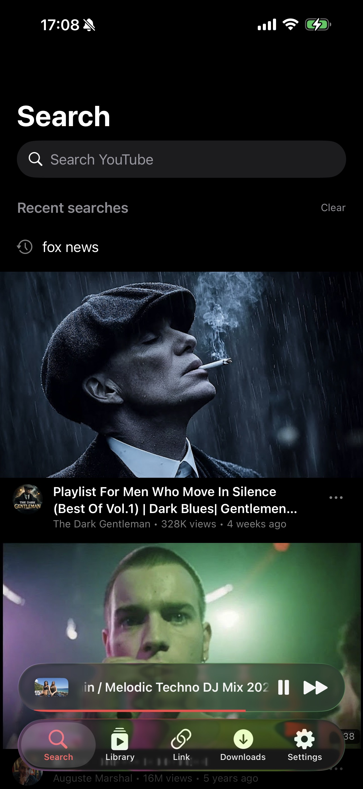<br>
      <sub><b>Search</b> · recent queries pinned above the home feed</sub>
    </td>
    <td align="center" width="33%">
      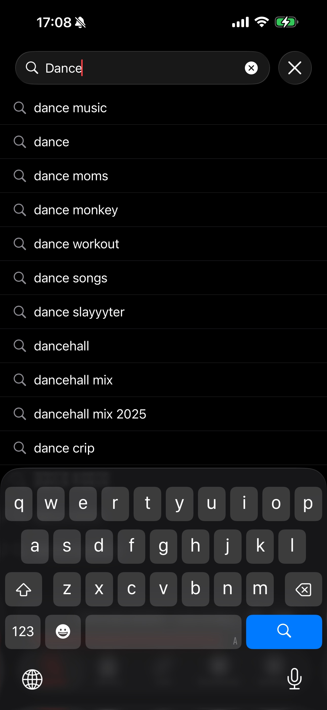<br>
      <sub><b>Autocomplete</b> · live suggestions as you type</sub>
    </td>
    <td align="center" width="33%">
      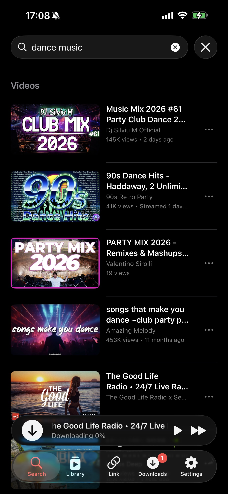<br>
      <sub><b>Results</b> · videos, playlists, channels in one list</sub>
    </td>
  </tr>
  <tr>
    <td align="center">
      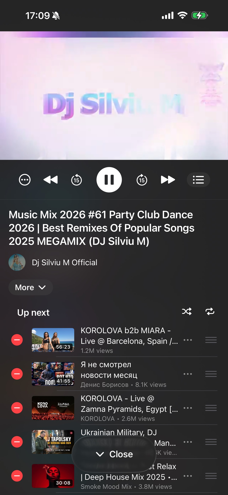<br>
      <sub><b>Player</b> · LNPopupUI-driven expanded surface</sub>
    </td>
    <td align="center">
      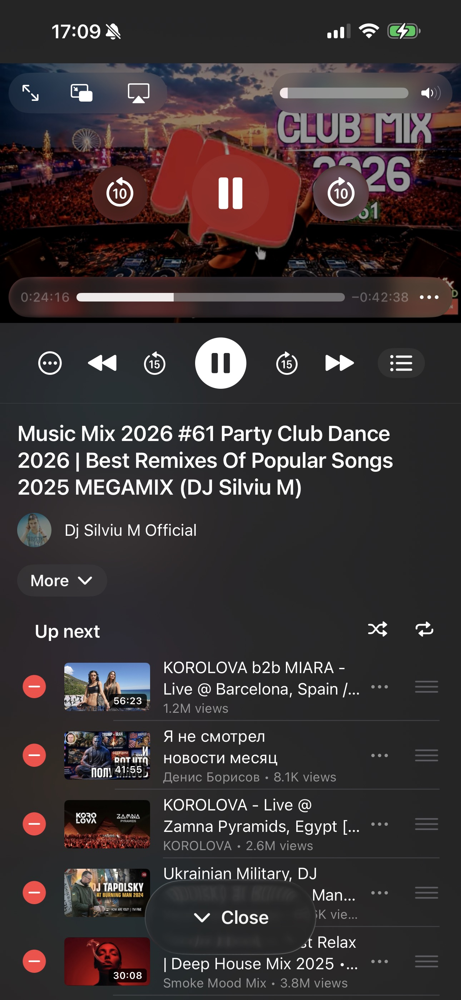<br>
      <sub><b>System controls</b> · scrubber, PiP, AirPlay, mute</sub>
    </td>
    <td align="center">
      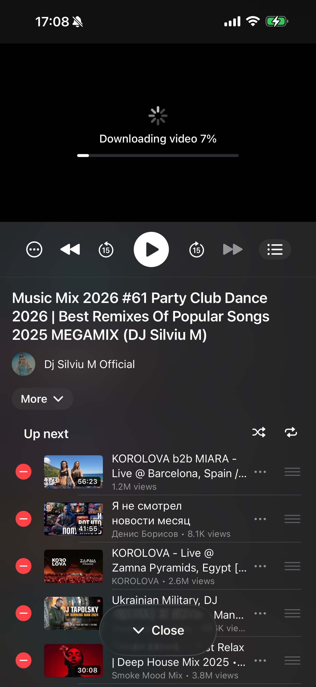<br>
      <sub><b>Live download</b> · yt-dlp progress before playback starts</sub>
    </td>
  </tr>
  <tr>
    <td align="center">
      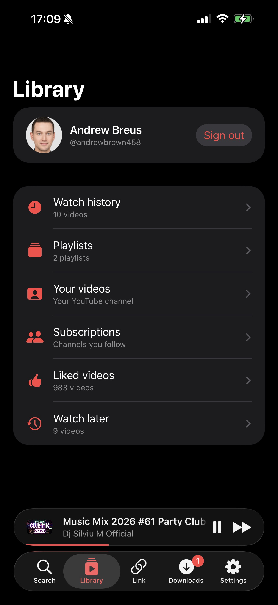<br>
      <sub><b>Library</b> · history, playlists, liked, Watch Later</sub>
    </td>
    <td align="center">
      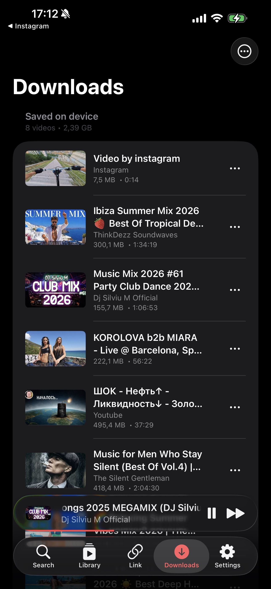<br>
      <sub><b>Downloads</b> · saved videos, offline-playable</sub>
    </td>
    <td align="center">
      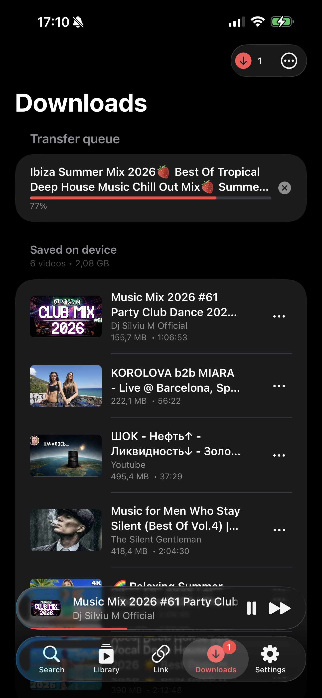<br>
      <sub><b>Transfer queue</b> · active downloads with cancel</sub>
    </td>
  </tr>
  <tr>
    <td align="center">
      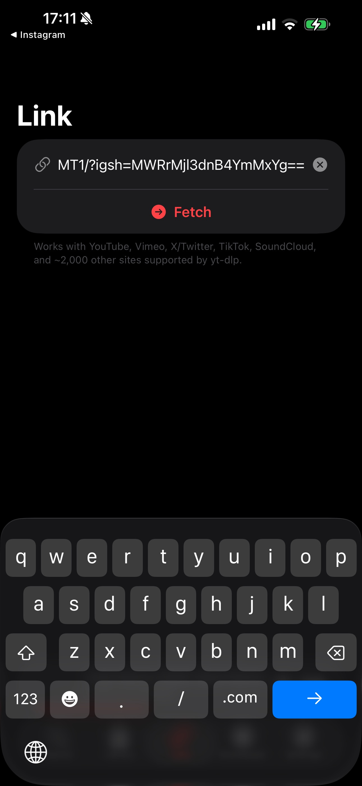<br>
      <sub><b>Link</b> · paste any URL from ~2,000 yt-dlp sites</sub>
    </td>
    <td align="center">
      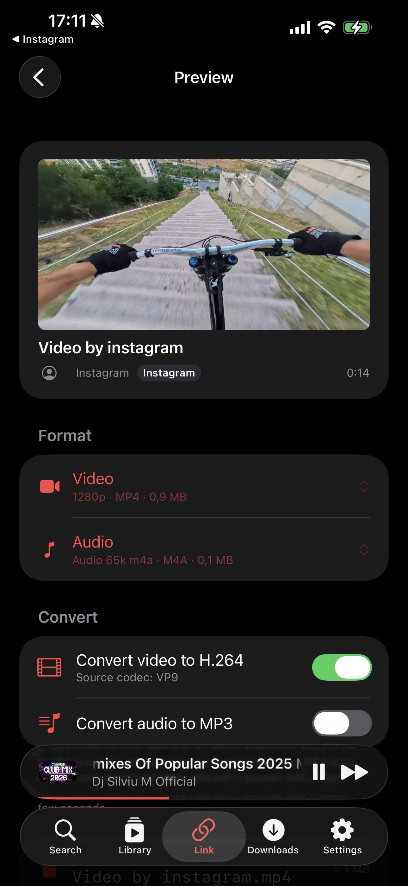<br>
      <sub><b>Preview</b> · pick format + transcode options</sub>
    </td>
    <td align="center">
      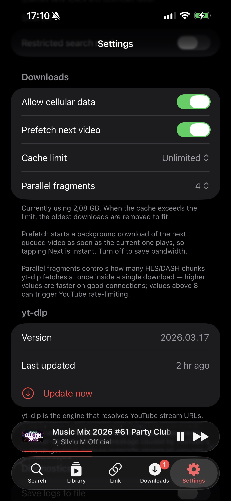<br>
      <sub><b>Settings</b> · cache limits + yt-dlp auto-refresh</sub>
    </td>
  </tr>
</table>

<sub>Screenshots taken on iPhone 17 Pro · iOS 26 · dark appearance is the only mode.</sub>

---

## Status

| Area | Status |
|---|---|
| Home / Search / Video detail | ✓ |
| Login (Google cookies via WKWebView) | ✓ |
| Subscriptions / Library / History | ✓ |
| Channel screen / Playlist screen | ✓ |
| Like / dislike / save-to-playlist | ✓ |
| Comments (read / write / reply / rate / translate) | ✓ |
| Background audio + lock-screen controls + AirPlay + PiP | ✓ |
| Downloads (user-initiated + implicit during playback) | ✓ |
| Three-tier playback fallback for PoT-locked content | ✓ |
| "Link" tab — universal downloader for ~2,000 sites via yt-dlp | ✓ |
| Localization: en / es / ru / fr / de | ✓ |
| CarPlay | ✗ |
| Chromecast | ✗ (out of scope) |

---

## Requirements

- Xcode 15 or later
- iOS 17.0 or later (real device recommended — Python / yt-dlp work, but Simulator can be flaky for ffmpeg-heavy paths)
- A Google account (or family-managed account); login is performed inside the app via a WebView

---

## Build

```bash
git clone <this repo>
open FreeTube/FreeTube.xcodeproj
```

Open in Xcode, set your signing team on the FreeTube target, then ⌘R.

Swift Package dependencies resolve automatically. If you hit "No such module 'FFmpegSupport'" or "No such module 'Kingfisher'" warnings from SourceKit, ignore them — `xcodebuild` still produces `BUILD SUCCEEDED`. Product → Clean Build Folder clears the stale index.

---

## Architecture

```
SwiftUI Views
   ↓ @Environment
@Observable ViewModels (Features/*)
   ↓ async / await
Services (Core/Networking/*)        ←  one Service per YouTubeKit response family
   ↓
YouTubeKitClient (cookies + visitor data)  +  DownloadManager (yt-dlp + ffmpeg)
   ↓
b5i/YouTubeKit  +  kewlbear/YoutubeDL-iOS  +  FFmpegSupport
```

**MVVM with a service layer:**

- Views never `import YouTubeKit` or `YoutubeDL`.
- ViewModels never network directly; they call services.
- Services are the only place that talks to YouTubeKit, yt-dlp, or ffmpeg.

See `CLAUDE.md` § 6 for the exact mapping from YouTubeKit response types to service methods.

---

## Tech stack

| Layer | Library |
|---|---|
| UI | SwiftUI (`@Observable`, iOS 17+) |
| YouTube API | [`b5i/YouTubeKit`](https://github.com/b5i/YouTubeKit) — cookie-based, no API key |
| Stream extraction | [`kewlbear/YoutubeDL-iOS`](https://github.com/kewlbear/YoutubeDL-iOS) (yt-dlp via PythonKit) |
| In-process ffmpeg | `FFmpegSupport` |
| Playback | `AVFoundation` / `AVKit` (`AVQueuePlayer`, `AVPlayerViewController`, `AVPictureInPictureController`) |
| Mini / expanded player | `LNPopupUI` |
| Now-playing animation | `SwimplyPlayIndicator` |
| Images | `Kingfisher` |
| Persistence | `SwiftData` (`@Model` + `@ModelActor` writer for history/favorites/search) + file extended attributes for downloads metadata |
| Secure storage | Keychain via `Security.framework` |
| Logging | `os.Logger`, subsystem `com.leshko.freetube` (matches the app bundle id) |

---

## Playback pipeline

Playback has three independent tiers. Whichever succeeds first wins.

```
User taps a video
        │
        ▼
┌─────────────────────────────────────────────────────────────┐
│ Tier 1: yt-dlp download → local mp4                         │
│   PythonKit + yt-dlp                                        │
│   Mux video+audio in Swift via FFmpegRunner (-c copy)       │
│   Persists metadata to file xattrs (DownloadsStore)         │
└─────────────────────────────────────────────────────────────┘
        │   fails (PoT, n-cipher, 403)
        ▼
┌─────────────────────────────────────────────────────────────┐
│ Tier 2: YouTubeKit progressive/adaptive → local mp4         │
│   TVHTML5 client → direct URLs (PoT-exempt)                 │
│   or player.js scrape → cipher-decoded URLs                 │
│   URLSession download + ffmpeg -c copy mux                  │
│   Persists metadata to file xattrs                          │
└─────────────────────────────────────────────────────────────┘
        │   fails
        ▼
┌─────────────────────────────────────────────────────────────┐
│ Tier 3: AVPlayer streaming (no local file)                  │
│   iOS HLS → iOS progressive → TVHTML5 HLS → TVHTML5 progressive │
│   AVPlayer streams the URL directly                         │
│   Not persisted, not offline-playable                       │
└─────────────────────────────────────────────────────────────┘
```

For most videos, tier 1 wins and you get an offline file. For YouTube's PoT-locked / n-cipher-locked content (kids and family videos most often), tier 1 and 2 fail and tier 3 streams the HLS manifest.

---

## Workarounds you should know about

These are the non-obvious bits. If you're refactoring `Core/`, read them first.

### Python on iOS doesn't tolerate cross-thread access

`PythonKit` + CPython require single-thread interpreter access. A plain Swift `actor` rotates between cooperative-pool workers and Python crashes. `PythonRunner` uses a **custom `SerialExecutor`** backed by a `DispatchQueue(.utility)` so GCD reuses the same worker thread, plus strict Task chaining via a `pump()` drain so even `await`-induced reentry can't double-enter yt-dlp.

### ffmpeg's C library is not thread-safe

The `+faststart` post-pass crashes on concurrent calls (`EXC_BAD_ACCESS` in `ff_format_shift_data`). `Hook.m`'s `setjmp`/`longjmp` is also unsafe across concurrent invocations. `FFmpegRunner` is a serial actor that all ffmpeg calls go through.

### yt-dlp's ffmpeg merger hangs on iOS

When yt-dlp's Python side calls `subprocess.Popen.communicate` against ffmpeg, the call never returns — `longjmp` tears through the Python interpreter stack. We pass `--ffmpeg-location /dev/null/no-ffmpeg` so yt-dlp fails fast at probe time instead of hanging, then mux ourselves with direct `FFmpegSupport.ffmpeg(...)` calls.

### YouTube's PoT and n-cipher

YouTube has been enforcing Proof-of-Origin Tokens and rotating the `n`-parameter cipher in player.js every 2-8 weeks. We solve the **n-cipher in-process** by faking a `deno` runtime to yt-dlp via JavaScriptCore — see CLAUDE.md §15.11 for the bridge architecture. **PoT** still requires Play-Integrity / DroidGuard attestation which a JS runtime can't provide; tier 3 streaming is the user-facing safety net for PoT-locked content.

### Cookie de-duplication prefers `.youtube.com`

Post-login, Apple's `WKHTTPCookieStore` returns identical cookies under both `.youtube.com` and `.google.com` scopes. YouTube only accepts the `.youtube.com` value. `CookieStore.dedupe` enforces that — length-based tiebreaking failed in practice (both scopes were 12 chars).

### Login WebView must use an ephemeral data store

`WKWebsiteDataStore.default()` reuses prior sessions and captures stale cookies. Login flow uses `.nonPersistent()`.

### `SubscriptionRegistry` reconciles YouTubeKit's gaps

YouTubeKit's `subscribeStatus` parser doesn't follow `pageHeaderRenderer` entity-key indirection. Channel screens always showed "Subscribe" even on subscribed channels until we added a `UserDefaults`-backed registry that subscribe/unsubscribe actions flip optimistically.

### `AVQueuePlayer.replaceCurrentItem(with:)` is a no-op on an empty queue

Use `removeAllItems()` + `insert(_:after:)`. The `loadItem` helper does this correctly.

### Don't log from SwiftUI body paths

`DownloadManager.localFile(for:)` is called from `Menu` bodies re-evaluating dozens of times per second under the player's KVO storm. Even `log.debug` floods the device log. Pure functions called from view bodies must be allocation-free and log-free.

---

## Authentication

1. `LoginScreen` shows a `WKWebView` against `accounts.google.com` using an **ephemeral** `WKWebsiteDataStore`.
2. After redirect to `youtube.com`, the cookies are read, de-duplicated (prefer `.youtube.com` scope), serialized to a Cookie-header string, and stored in Keychain.
3. `SessionManager.bootstrap()` reloads them at every app launch.
4. Required cookies: `SAPISID`, `__Secure-3PAPISID`, `LOGIN_INFO`, `SID`, `HSID`, `SSID`, `APISID`. All must be present for `.loggedIn`.
5. On expiry / 401: Keychain is wiped, `AuthState.loggedOut` is set, root routes to Login.

Cookies typically last 1-2 weeks of inactivity. There is no refresh mechanism — YouTube doesn't expose one for cookie-based clients.

---

## Downloads

Two paths into `DownloadManager.ensureDownloaded`:

1. **Implicit (during playback).** Every play tap also produces an offline file at priority `.userInitiated`. The Downloads tab self-populates as you watch.
2. **Explicit (Download button).** From the player menu, priority `.background`.

Plus a third entry point for non-YouTube content:

3. **"Link" tab.** Paste any URL from one of ~2,000 sites yt-dlp supports (Vimeo, Twitter/X, TikTok, SoundCloud, Instagram, …). `YtDlpInfoService` probes via `extract_info`, the Preview screen renders a format picker, and the chosen variant is downloaded by `URLDownloadManager`. Optional on-device transcode to H.264 / MP3 via FFmpeg's `h264_videotoolbox` and `libmp3lame` encoders.

`PythonRunner` has a two-bucket priority queue. Play taps jump ahead of any queued background work (Download All, prefetch). It cannot preempt the currently-running yt-dlp — Python has no safe interrupt point.

All downloaded files land at the **Documents root** and are visible in the iOS Files app under "On My iPhone" (gated by `UIFileSharingEnabled` + `LSSupportsOpeningDocumentsInPlace` in Info.plist). Metadata (title, channel, original URL, compressed thumbnail, duration) travels with each file as an **extended attribute** — no SwiftData row, no sidecar files.

Settings:
- **Allow cellular data** (default on) — `NWPathMonitor` gates `ensureDownloaded`.
- **Prefetch next video** (default on) — background download of the queue's next item so Next-tap is instant.
- **Concurrent fragments** — yt-dlp `--concurrent-fragments`, default 4.
- **Download cache limit** — bytes. When exceeded, oldest downloads get evicted.

---

## Localization

`Localizable.xcstrings` is fully translated for **English / Spanish / Russian / French / German** (236 keys).

To add a string: use `String(localized:)` / `LocalizedStringKey` in code, build once, then translate the new `state: "new"` entries in the catalog.

---

## What this app does not do

Honest list:

- **Doesn't bypass YouTube's PoT enforcement.** Affected content streams via HLS instead of downloading. (N-cipher *is* solved in-process via the JSC bridge.)
- **Doesn't attempt App Store distribution.** Sideload, TestFlight, or personal use only.
- **Doesn't include analytics, telemetry, or remote logging.** Everything goes to `os.Logger`.
- **Doesn't have a refresh-token flow.** Cookies expire, you re-login.
- **Doesn't support Chromecast / Google Cast.** AirPlay only.
- **Doesn't have CarPlay** yet.

---

## Repository layout

```
FreeTube/                    # The Xcode workspace
└── FreeTube/
    ├── App/                 # FreeTubeApp + RootView + AppEnvironment
    ├── Core/
    │   ├── Networking/      # YouTubeKit-backed services
    │   ├── Auth/            # Cookies, Keychain, Login, AuthState, SubscriptionRegistry
    │   ├── Player/          # PlayerStateManager + queue + audio session + now-playing
    │   ├── Download/        # DownloadManager (yt-dlp + ffmpeg + URLSession.background)
    │   ├── Persistence/     # @Model types + PersistenceWriter @ModelActor + DownloadsStore (xattr-backed)
    │   ├── JavaScript/      # JS bridge for yt-dlp's deno-shaped n-cipher solver
    │   └── Models/          # Domain types
    ├── Features/            # One folder per screen, Screen + ViewModel
    ├── UI/
    │   ├── Player/          # FullScreenPlayer, PlayerSurface, progress overlay
    │   ├── Components/      # Cards, rows, sheets
    │   └── Modifiers/       # ErrorToastModifier
    └── Localizable.xcstrings
```

---

## Contributing

Read `CLAUDE.md` first — it documents the constraints, conventions, and the workarounds in `Core/` that are easy to break by accident.

Tests live in `FreeTubeTests/` mirroring the source structure. Run them before opening a PR.

---

## License

Personal-use / sideload distribution. No public re-distribution intended. See the **Disclaimer** at the top of this README for the full terms under which this software is provided.
